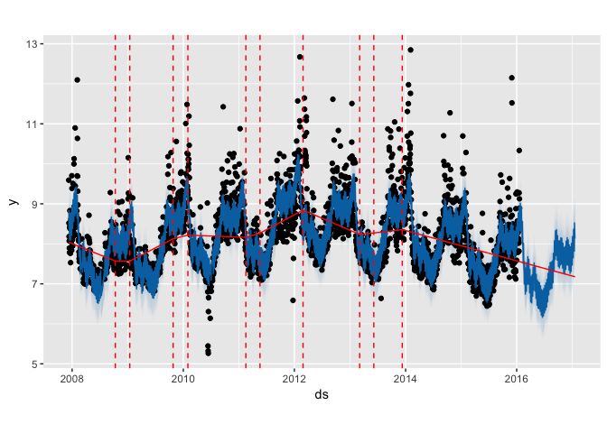
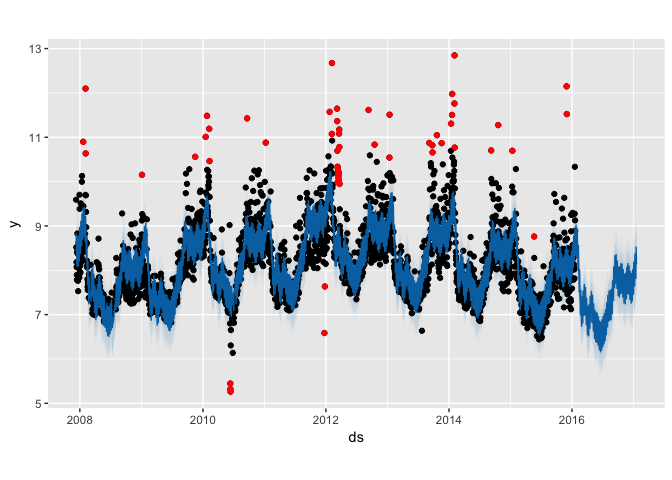
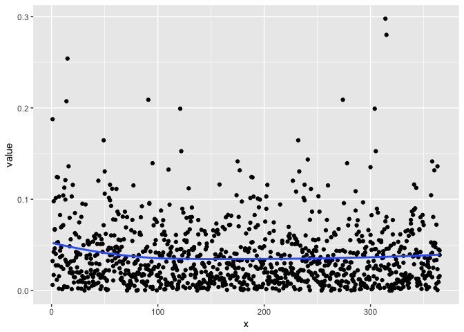

<!-- README.md is generated from README.Rmd. Please edit that file -->


# prophetExt

[](https://travis-ci.org/hoxo-m/prophetExt)

Extension for Facebook [Prophet](https://github.com/facebookincubator/prophet).

## Installation

You can install prophetExt from github with:


```r
# install.packages("devtools")
devtools::install_github("hoxo-m/prophetExt")
```

or


```r
# install.packages("githubinstall")
githubinstall::githubinstall("prophetExt")
```

## Example

Ready data.


```r
df <- read.csv("https://raw.githubusercontent.com/facebookincubator/prophet/master/examples/example_wp_peyton_manning.csv")
df$y <- log(df$y)
```

Fit model.


```r
library(prophet)
m <- prophet(df)
```

### Change Points

Pick changepoints.


```r
library(prophetExt)
cpts <- prophet_pick_changepoints(m)
head(cpts)
#>   changepoints  growth_rate      delta
#> 1   2007-12-10 -0.355170111  0.0000000
#> 2   2008-10-11 -0.005433292  0.3497368
#> 3   2009-01-14  0.453643069  0.4590764
#> 4   2009-10-26  0.212617070 -0.2410260
#> 5   2010-01-31 -0.032368395 -0.2449855
#> 6   2011-02-16  0.258211353  0.2905797
```

Draw changepoints.


```r
future <- make_future_dataframe(m, 365)
fore <- predict(m, future)
plot(m, fore) + autolayer(cpts)
```

<!-- -->

### Outliers

Detect outliers.


```r
outliers <- prophet_detect_outliers(m)
```


```r
head(outliers)
#>           ds        y     yhat    resid      p_value
#> 1 2008-01-21 10.89720 9.250155 1.647047 4.990818e-02
#> 2 2008-02-04 12.09746 9.215482 2.881975 6.718208e-07
#> 3 2008-02-05 10.63528 8.930037 1.705241 3.265459e-02
#> 4 2009-01-04 10.15382 8.306900 1.846918 1.541861e-02
#> 5 2009-11-16 10.55870 8.865276 1.693423 3.490245e-02
#> 6 2010-01-17 11.00793 9.259726 1.748206 2.644435e-02
```

Draw outliers.


```r
plot(m, fore) + autolayer(outliers)
```

<!-- -->

Draw outliers using calendar plot.


```r
prophet_calendar_plot(outliers)
```

<!-- -->

### SHF (Simulated Historical Forcast)


```r
shf <- prophet_shf(m, periods = 365)
```


```r
head(shf$estimated)
#>   x      value
#> 1 1 0.05222963
#> 2 2 0.05196028
#> 3 3 0.05169278
#> 4 4 0.05142713
#> 5 5 0.05116335
#> 6 6 0.05090144
```


```r
plot(shf)
```

<!-- -->
