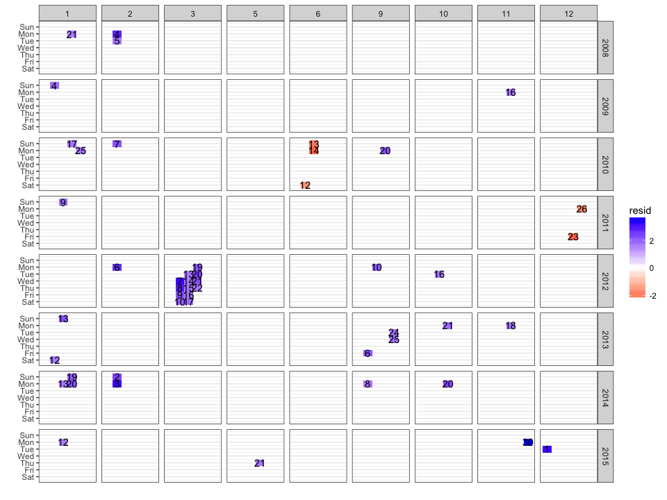

<!-- README.md is generated from README.Rmd. Please edit that file -->

# prophetExt

[](https://travis-ci.org/hoxo-m/prophetExt)
[](https://cran.r-project.org/package=prophetExt)

Extension for Facebook
[Prophet](https://github.com/facebookincubator/prophet).

## Installation

You can install prophetExt from github with:

``` r
# install.packages("devtools")
devtools::install_github("hoxo-m/prophetExt")
```

or

``` r
# install.packages("githubinstall")
githubinstall::githubinstall("prophetExt")
```

## Example

Ready
data.

``` r
df <- read.csv("https://raw.githubusercontent.com/facebook/prophet/master/examples/example_wp_peyton_manning.csv")
df$y <- log(df$y)
```

Fit model.

``` r
library(prophet)
m <- prophet(df, daily.seasonality = FALSE)
```

### Change Points

Pick changepoints.

``` r
library(prophetExt)
cpts <- prophet_pick_changepoints(m)
head(cpts)
#>   changepoint  growth_rate      delta
#> 1  2007-12-10 -0.360276798         NA
#> 2  2008-10-11 -0.002125965  0.3581510
#> 3  2009-01-14  0.458734213  0.4608602
#> 4  2009-10-26  0.217411387 -0.2365794
#> 5  2010-01-31 -0.034489145 -0.2519005
#> 6  2011-02-16  0.252856713  0.2873459
```

Draw changepoints.

``` r
future <- make_future_dataframe(m, 365)
fore <- predict(m, future)
plot(m, fore) + autolayer(cpts)
```

<!-- -->

### Outliers

Detect outliers.

``` r
outliers <- prophet_detect_outliers(m)
```

``` r
head(outliers)
#>           ds        y     yhat    resid      p_value
#> 1 2008-01-21 10.89720 9.257430 1.639772 4.921098e-02
#> 2 2008-02-04 12.09746 9.218465 2.878991 7.197366e-07
#> 3 2008-02-05 10.63528 8.932996 1.702283 3.401723e-02
#> 4 2009-01-04 10.15382 8.304355 1.849463 1.626819e-02
#> 5 2009-11-16 10.55870 8.868621 1.690078 3.651931e-02
#> 6 2010-01-17 11.00793 9.264015 1.743917 2.793262e-02
```

Draw outliers.

``` r
plot(m, fore) + autolayer(outliers)
```

<!-- -->

Draw outliers using calendar plot.

``` r
prophet_calendar_plot(outliers)
```

<!-- -->

### SHF (Simulated Historical Forcast)

``` r
shf <- prophet_shf(m, periods = 365)
```

``` r
head(shf$estimated)
#>   x      value
#> 1 1 0.05239550
#> 2 2 0.05211918
#> 3 3 0.05184478
#> 4 4 0.05157229
#> 5 5 0.05130174
#> 6 6 0.05103313
```

``` r
plot(shf)
```

<!-- -->
